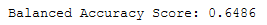

# Credit_Risk_Analysis

## Resources
Jupyter Notebook 6.3.0 Pandas 1.2.4

## Overview

## Results

[Fig1a: Random Oversampler Accuracy Score](other_resources/01a_RandomOverSampler_AccScore.png?raw=true "Figure 1a: Random Oversampler Accuracy Score")

[Fig1b: Random Oversampler Confusion Matrix](other_resources/01b_RandomOverSampler_ConfusionMatrix.png?raw=true "Figure 1b: Random Oversampler Confusion Matrix")

[Fig1c: Random  Imbalanced Classification](other_resources/01c_RandomOverSampler_ImbalancedClassification.png?raw=true "Figure 1c: Random Oversampler Imbalanced Classification")

[Fig2a: SMOTE Accuracy Score](other_resources/02a_SMOTE_AccScore.png?raw=true "Figure 2a: SMOTE Accuracy Score")

[Fig2b: SMOTE Confusion Matrix](other_resources/02b_SMOTE_ConfusionMatrix.png?raw=true "Figure 2b: SMOTE Confusion Matrix")

[Fig2c: SMOTE  Imbalanced Classification](other_resources/02c_SMOTE_ImbalancedClassification.png?raw=true "Figure 2c: SMOTE Imbalanced Classification")

[Fig3a: ClusterCentroids Accuracy Score](other_resources/03a_ClusterCentroids_AccScore.png?raw=true "Figure 3a: ClusterCentroids Accuracy Score")

[Fig3b: ClusterCentroids Confusion Matrix](other_resources/03b_ClusterCentroids_ConfusionMatrix.png?raw=true "Figure 3b: ClusterCentroids Confusion Matrix")

[Fig3c: ClusterCentroids Imbalanced Classification](other_resources/03c_ClusterCentroids_ImbalancedClassification.png?raw=true "Figure 3c: ClusterCentroids Imbalanced Classification")

[Fig4a: SMOTEEN Accuracy Score](other_resources/04a_SMOTEENN_AccScore.png?raw=true "Figure 4a: SMOTEEN Accuracy Score")

[Fig4b: SMOTEEN Confusion Matrix](other_resources/04b_SMOTEENN_ConfusionMatrix.png?raw=true "Figure 4b: SMOTEEN Confusion Matrix")

[Fig4c: SMOTEEN Imbalanced Classification](other_resources/04c_SMOTEENN_ImbalancedClassification.png?raw=true "Figure 4c: SMOTEEN Imbalanced Classification")

[Fig5a: Balanced Random Forest Accuracy Score](other_resources/05a_BalRandomForest_AccScore.png?raw=true "Figure 5a: Balanced Random Forest Accuracy Score")

[Fig5b: Balanced Random Forest Confusion Matrix](other_resources/05b_BalRandomForest_ConfusionMatrix.png?raw=true "Figure 5a: Balanced Random Forest Confusion Matrix")

[Fig5c: Balanced Random Forest Imbalanced Classification](other_resources/05c_BalRandomForest_ImbalancedClassification.png?raw=true "Figure 5c: Balanced Random Forest Imbalanced Classification")

[Fig6a: AdaBoost Accuracy Score](other_resources/06a_AdaBoost_AccScore.png?raw=true "Figure 6a: AdaBoost Accuracy Score")

[Fig6b: AdaBoost Confusion Matrix](other_resources/06b_AdaBoost_ConfusionMatrix.png?raw=true "Figure 6b: AdaBoost Confusion Matrix")

[Fig6c: AdaBoost Imbalanced Classification](other_resources/06c_AdaBoost_ImbalancedClassification.png?raw=true "Figure 6c: AdaBoost Imbalanced Classification")

## Summary