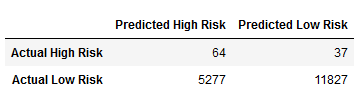
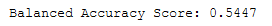
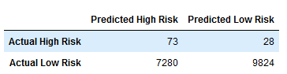

# Credit_Risk_Analysis

## Resources
Jupyter Notebook 6.3.0 Pandas 1.2.4

## Overview

FastLending would like to use machine learning to predict credit risk.  The hypothesis is that machine learning will provide a faster and more reliable loan experience to clients, as well as lowered default rates amongst its clientelle.  We endeavor to test and compare six different machine learning algorithms.

## Results

[Fig1a: Random Oversampler Accuracy Score](other_resources/01a_RandomOverSampler_AccScore.png?raw=true "Figure 1a: Random Oversampler Accuracy Score")

- As a first pass at classifying high vs. low risk, Figure 1a displays the results of a random oversamling algorithm.  The accuracy score, or the percetage of times the model correctly classifies the results, is a low 65%.  Given the size of the imbalance however, accuracy is not the best evaluative metric.  

[Fig1b: Random Oversampler Confusion Matrix](other_resources/01b_RandomOverSampler_ConfusionMatrix.png?raw=true "Figure 1b: Random Oversampler Confusion Matrix")

[Fig1c: Random  Imbalanced Classification](other_resources/01c_RandomOverSampler_ImbalancedClassification.png?raw=true "Figure 1c: Random Oversampler Imbalanced Classification")

- More detail for the Random oversampler is evidenced in Figure 1c.  The high risk loans have a low precision of 1%, which is to say that given a high risk prediction, there is a 1% chance that the loan is actually high risk.  With a recall of 69%, the model indicates that for High Risk loans, the model will correctly predict 69% of those results as being high risk.

[Fig2a: SMOTE Accuracy Score](other_resources/02a_SMOTE_AccScore.png?raw=true "Figure 2a: SMOTE Accuracy Score")

- The SMOTE accuracy is similar, if slightly higher than the imbalanced classification.  66% is still rather low for the purposes of the model.

[Fig2b: SMOTE Confusion Matrix](other_resources/02b_SMOTE_ConfusionMatrix.png?raw=true "Figure 2b: SMOTE Confusion Matrix")

[Fig2c: SMOTE  Imbalanced Classification](other_resources/02c_SMOTE_ImbalancedClassification.png?raw=true "Figure 2c: SMOTE Imbalanced Classification")

- The SMOTE recall is lower, at 63%, and the precision remains at 1%.  Given a high risk loan, there is a 63% chance that it is actually high risk.  

[Fig3a: ClusterCentroids Accuracy Score](other_resources/03a_ClusterCentroids_AccScore.png?raw=true "Figure 3a: ClusterCentroids Accuracy Score")

- Cluster Centroids Accuracy is a meaningful decline, to 55%.  While accuracy is not the best metric for these purposes, a there is no reason to accept a decline.

[Fig3b: ClusterCentroids Confusion Matrix](other_resources/03b_ClusterCentroids_ConfusionMatrix.png?raw=true "Figure 3b: ClusterCentroids Confusion Matrix")

[Fig3c: ClusterCentroids Imbalanced Classification](other_resources/03c_ClusterCentroids_ImbalancedClassification.png?raw=true "Figure 3c: ClusterCentroids Imbalanced Classification")

- Cluster Centroid precision remains at 1%, while recall has climbed back to the starting point of 69%.

[Fig4a: SMOTEEN Accuracy Score](other_resources/04a_SMOTEENN_AccScore.png?raw=true "Figure 4a: SMOTEEN Accuracy Score")

- SMOTEEN accuracy score is in the same realm as prior models, at 65%.  Again, accuracy is not necessarily the best measure here.

[Fig4b: SMOTEEN Confusion Matrix](other_resources/04b_SMOTEENN_ConfusionMatrix.png?raw=true "Figure 4b: SMOTEEN Confusion Matrix")

[Fig4c: SMOTEEN Imbalanced Classification](other_resources/04c_SMOTEENN_ImbalancedClassification.png?raw=true "Figure 4c: SMOTEEN Imbalanced Classification")

- SMOTEEN precision remains 1%, as with prior models, but recall has risen to 72%.  This means that given a high risk loan, the model will classify it correctly 72% of the time.

[Fig5a: Balanced Random Forest Accuracy Score](other_resources/05a_BalRandomForest_AccScore.png?raw=true "Figure 5a: Balanced Random Forest Accuracy Score")

- While accuracy is still not the best metric for highly imbalanced datasets, the Balanced Random Forest Accuracy of 79% is reasonable.

[Fig5b: Balanced Random Forest Confusion Matrix](other_resources/05b_BalRandomForest_ConfusionMatrix.png?raw=true "Figure 5a: Balanced Random Forest Confusion Matrix")

[Fig5c: Balanced Random Forest Imbalanced Classification](other_resources/05c_BalRandomForest_ImbalancedClassification.png?raw=true "Figure 5c: Balanced Random Forest Imbalanced Classification")

- Balanced Random Forest precision has risen to 3%, meaning that given a high risk prediction there is a 3% likelihood that that loan is in fact high risk.  Still not very precise, but it's 3x higher than prior models.  Recall of 70%, or given that a loan is high risk the probability that the model correctly classifies it as such is 70%.  Relatedly, the recall of low risk is 87%, indicating that the model has an 87% chance of correctly classifying a low risk loan.

[Fig5d: Balanced Random Forest Importances](other_resources/05d_BalRandomForest_Importances.png?raw=true "Figure 5d: Balanced Random Forest Importances")

[Fig6a: AdaBoost Accuracy Score](other_resources/06a_AdaBoost_AccScore.png?raw=true "Figure 6a: AdaBoost Accuracy Score")

The last model, AdaBoost, exhibits an accuracy score of 92%.  While accuracy is still not terribly important, it builds confidence to have an accuracy measure this high.

[Fig6b: AdaBoost Confusion Matrix](other_resources/06b_AdaBoost_ConfusionMatrix.png?raw=true "Figure 6b: AdaBoost Confusion Matrix")

[Fig6c: AdaBoost Imbalanced Classification](other_resources/06c_AdaBoost_ImbalancedClassification.png?raw=true "Figure 6c: AdaBoost Imbalanced Classification")
 
 AdaBoost precision increases to 5%: still low, but not surprising given a heavily imbalanced data set.  Of more import the recall scores for high and low risk are 93% and 90% respectively.

## Summary

The over and undersampling models tend to hover at 55-65% accuracy, with recall values generally about 60-70%.  The ensemble methods exhibit a clear break in quality, with accuracy scores jumping to the 80-90% range, and recall rates up into the 70-90% range.  The most appropriate model appears to be the AdaBoost.

------
**Contact:**

**E-Mail:** chrabach@gmail.com

**Twitter:** @chrabach
